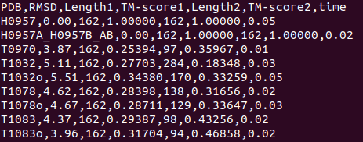

# TMalignM2M [TMalign many-to-many]
The pipeline to run TMalign in the following ways:
1. One PDB vs a directory of PDBs [One-to-many]
2. A directory of PDBs vs another directory of PDBs [Many-to-many]

----

## TMalign1toM
```
$ sh runTMalign1toM.sh <input_pdb> <run_against_pdb or directory> <output_directory> <tm-score_threshold>
```
### Example
```
sh ./runTMalign1toM.sh ./test_tmalign/H0957.pdb ./test_pdbs/test_tmalign/ ./test_out_12m/ 0.3
```
## TMalignMtoM
```
$ sh runTMalign1toM.sh <input_pdb_directory> <run_against_pdb_directory> <output_directory> <tm-score_threshold>
```
This generates an output text file for each PDB in the input directory.

### Example
```
sh ./runTMalignM2M.sh ./test_m2m/ ./test_pdbs/test_tmalign/ ./test_out_m2m/ 0.4
```
----

## Ouput Sample


## Installation [TODO]


